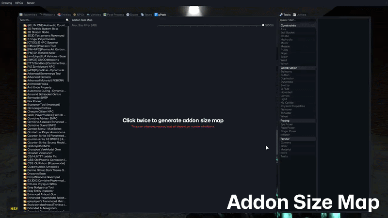

h# DAddonMap

A VGUI component for Garry's Mod that renders a square map of the overall size of currently installed addons. Based on flat tree-mapping algorithms to display rectangles of uniform aspect ratios.

<div>
  <br>
  <sup><a href="https://github.com/JWalkerMailly/GPeek"><em>As seen in gPeek</em></a> | <a href="https://github.com/JWalkerMailly/Derma-Github-Theme"><em>Derma-Github-Theme</em></a></sup>
</div>

> [!NOTE]
> Artificial intelligence (AI), specifically Claude, was used to translate the “properties” file into 31 other languages supported by GMod.
> Claude AI was also used to help cleanup the LDoc comments of the async squaremap + merge-sort module.

<br>

## ✨ Features
* Size filtering for granular search
* Fast async tree-map algorithm for space partitioning
* Lookup index with variable kernel for near O(1) filter lookups
* Steamworks caching and filesystem lookups for preview ids
* Deferred rendering with batching using render targets to reduce draw calls
* Async map rendering based on progress

<br>

## 📝 Usage

```lua
local map = vgui.Create("DAddonMap")
```

<br>

## 🧩 API

### `PANEL:OnClickAddon(addon)`

Callback upon clicking an addon.

| Parameter | Type | Description |
|---|---|---|
| `addon` | table | Addon object containing its meta-data. For more info, see this page: [engine.GetAddons()](https://wiki.facepunch.com/gmod/engine.GetAddons) |

### `PANEL:OnRightClickAddon(addon)`

Callback upon right clicking an addon.

| Parameter | Type | Description |
|---|---|---|
| `addon` | table | Addon object containing its meta-data. For more info, see this page: [engine.GetAddons()](https://wiki.facepunch.com/gmod/engine.GetAddons) |

<br>

## ✏️ Architecture

DAddonMap is built around:

- Deferred async rendering
- Batch processing of Steamworks preview IDs
- One-time map generation through render targets
- Flat tree-map algorithm with fast async merge-sort

## 📖 References
* **Squarified Treemaps**: https://vanwijk.win.tue.nl/stm.pdf
* **Mergesort**: https://algs4.cs.princeton.edu/22mergesort/
